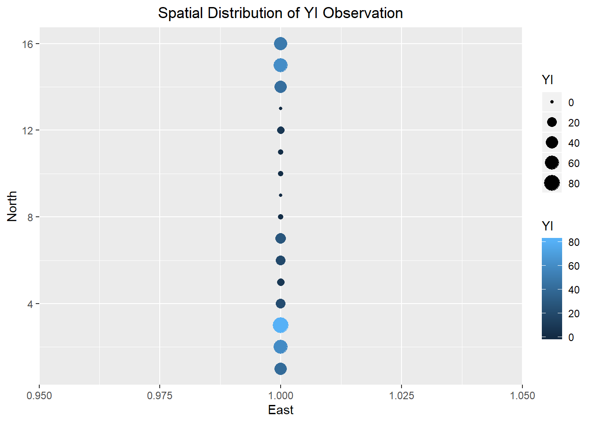
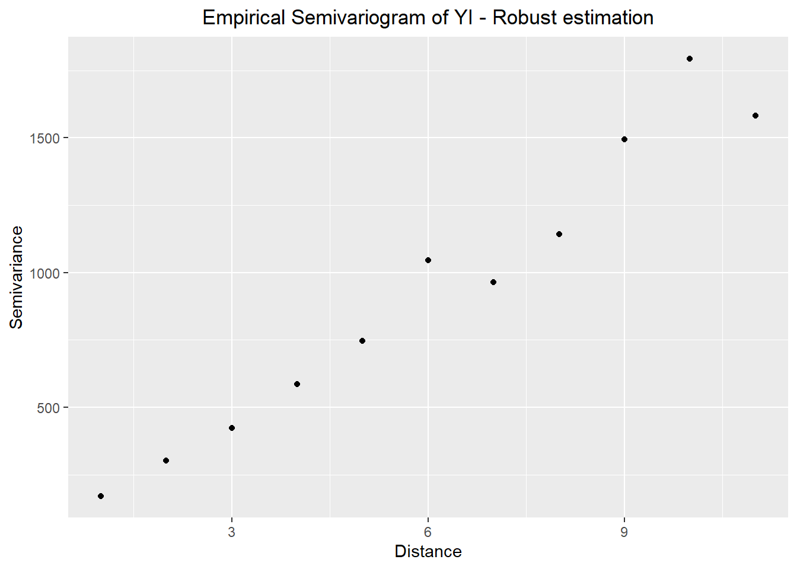

# Exercise 9.4 {#ex9_4}

## Load packages

Here is the R code to download the required packages for this exercise.


```r
# install package manager 'pacman'
if (!require(pacman)){
  install.packages('pacman')
}
```

```
## Loading required package: pacman
```

```r
# load packages needed for this exercise
library(pacman)
p_load(tidyverse,
       lctools, # to calculate Moran's I
       spdep, # to calculate geary's c
       geoR, # to compute variogram
       gridExtra, # to stack plots
       gstat, automap, # packages for variogram model selection
       sp # need a function called `coordinates`
       )
```

## Data

This is equivalent to data step in SAS. Here, the data is entered inside a function called `tibble`.


```r
# Enter data
a <- tibble(I = 1:16, YI = c(41, 60, 81, 22, 8, 20, 28, 2,
                             0, 2, 2, 8, 0, 43, 61, 50)) %>% 
  # creat new variable East and North
  mutate(East = 1,
         North = I)

# print the data
a
```

```
## # A tibble: 16 x 4
##        I    YI  East North
##    <int> <dbl> <dbl> <int>
##  1     1    41     1     1
##  2     2    60     1     2
##  3     3    81     1     3
##  4     4    22     1     4
##  5     5     8     1     5
##  6     6    20     1     6
##  7     7    28     1     7
##  8     8     2     1     8
##  9     9     0     1     9
## 10    10     2     1    10
## 11    11     2     1    11
## 12    12     8     1    12
## 13    13     0     1    13
## 14    14    43     1    14
## 15    15    61     1    15
## 16    16    50     1    16
```

## Autocorrelation statistics


```r
# visualize the data
ggplot(data = a) +
  geom_point(mapping = aes(x = East, y = North, size = YI, color = YI)) +
  ggtitle("Spatial Distribution of YI Observation") +
  theme(plot.title = element_text(hjust = 0.5))
```



```r
# calculate Moran's I
Coords <- a %>% 
  dplyr::select(East, North)

mI <- moransI(Coords, Bandwidth = 1, a$YI)

# print Moran's I table
moran.table <- tribble(
  ~`Moran's I`, ~`Expected I`, ~`Z randomization`, ~`P value randomization`,
  #------------/--------------/-------------------/------------------------
  mI$Morans.I, mI$Expected.I,  mI$z.randomization, mI$p.value.randomization
  )

moran.table
```

```
## # A tibble: 1 x 4
##   `Moran's I` `Expected I` `Z randomization` `P value randomization`
##         <dbl>        <dbl>             <dbl>                   <dbl>
## 1       0.625      -0.0667              2.81                 0.00499
```

```r
# create Moran's I scatter plot
l.moran <- l.moransI(Coords, Bandwidth = 1, a$YI)
```


```r
# calculate geary's c
Coords_num <- coordinates(Coords)

# create an object of class 'nb' so that it can be used with function from packege `spdep`
Coords_nb <- knn2nb(knearneigh(Coords_num))

# create a 'listw' object for use in the function `geary.test`
coords_listw <- nb2listw(Coords_nb)

gearyC <- geary.test(a$YI, coords_listw, alternative = "two.sided")
gearyC
```

```
## 
## 	Geary C test under randomisation
## 
## data:  a$YI 
## weights: coords_listw 
## 
## Geary C statistic standard deviate = 2.5826, p-value = 0.009806
## alternative hypothesis: two.sided
## sample estimates:
## Geary C statistic       Expectation          Variance 
##        0.37085605        1.00000000        0.05934473
```

## First variogram  

We will use the package `geoR` to construct empricial variogram, and then draw them using package `ggplot2`.  


```r
v1 <- variog(coords = Coords_num, data = a$YI, breaks = seq(0.5, 15.5),
             max.dist = 11)
```

```
## variog: computing omnidirectional variogram
```

```r
# extract data from object v1 for plotting
v1_plot_data <- cbind(v1$u, v1$v, v1$n) %>% 
  as.data.frame() %>% 
  dplyr::rename(Distance = V1,
                Semivariance = V2,
                Pair_count = V3)

# in the table below, gamma is semivariance
v1_plot_data
```

```
##    Distance Semivariance Pair_count
## 1         1     258.8333         15
## 2         2     533.0000         14
## 3         3     576.6154         13
## 4         4     580.1667         12
## 5         5     754.0000         11
## 6         6     958.2000         10
## 7         7    1020.4444          9
## 8         8     966.7500          8
## 9         9    1006.2857          7
## 10       10    1244.6667          6
## 11       11     941.8000          5
```

```r
# plot variogram
v1_plot_vario <- ggplot(data = v1_plot_data) +
  geom_point(mapping = aes(x = Distance, y = Semivariance)) +
  ggtitle("Empirical Semivariogram of YI") +
  theme(plot.title = element_text(hjust = 0.5))

# plot pair counts
v1_plot_pair_count <- ggplot(data = v1_plot_data) +
  geom_col(mapping = aes(x = Distance, y = Pair_count), width = 0.01, color = "blue")

# stack two plots
grid.arrange(v1_plot_vario, v1_plot_pair_count,
             ncol = 1, heights = c(3, 1))
```


## Second variogram  

Plot robust and classical variogram together.  


```r
# fit robust variogram
v1_robust <- variog(coords = Coords_num, data = a$YI, breaks = seq(0.5, 15.5),
             max.dist = 11, estimator.type = "modulus")
```

```
## variog: computing omnidirectional variogram
```

```r
# extract the data
v1_robust_data <- cbind(v1_robust$u, v1_robust$v, v1_robust$n) %>% 
  as.data.frame() %>% 
  dplyr::rename(Distance = V1,
                Semivariance = V2,
                Pair_count = V3)

# plot robust variogram
v1_robust_vario <- ggplot(data = v1_robust_data) +
  geom_point(mapping = aes(x = Distance, y = Semivariance)) +
  ggtitle("Empirical Semivariogram of YI - Robust estimation") +
  theme(plot.title = element_text(hjust = 0.5))

v1_robust_vario
```



```r
# combine robust and classical variogram  
var_comb <- v1_robust_data %>% 
  
  # combine robust and classical variogram datasets
  dplyr::rename(Semivariance_robust = Semivariance) %>% 
  bind_cols(dplyr::select(v1_plot_data, Semivariance)) %>% 
  gather(key = "Semivariance_type", value = "Semivariance", -c(Distance, Pair_count)) %>% 
  
  # plot
  ggplot() +
  geom_point(mapping = aes(x = Distance, y = Semivariance, color = Semivariance_type)) +
  ggtitle("Empirical Semivariogram for YI") +
  theme(plot.title = element_text(hjust = 0.5))

var_comb
```


## Variogram model selection 

We will use the package `gstat` and `automap` for variogram model selection


```r
# specify coordinates in the dataset
coordinates(a) = ~East+North

# select the best model out of exponential, spherical, and gaussian  
autofitVariogram(YI ~ East + North, a, model = c("Sph", "Exp", "Gau"))
```

```
## $exp_var
##   np dist    gamma dir.hor dir.ver   id
## 1 15    1 258.8333       0       0 var1
## 2 14    2 533.0000       0       0 var1
## 3 13    3 576.6154       0       0 var1
## 4 12    4 580.1667       0       0 var1
## 5 11    5 754.0000       0       0 var1
## 
## $var_model
##   model    psill    range
## 1   Nug   0.0000 0.000000
## 2   Exp 854.3133 2.575499
## 
## $sserr
## [1] 28783.32
## 
## attr(,"class")
## [1] "autofitVariogram" "list"
```

```r
# fit empirical variogram
v_emp <- variogram(YI ~ East + North, data = a, cutoff = 11)
v_emp
```

```
##    np dist gamma dir.hor dir.ver   id
## 1  15    1   NaN       0       0 var1
## 2  14    2   NaN       0       0 var1
## 3  13    3   NaN       0       0 var1
## 4  12    4   NaN       0       0 var1
## 5  11    5   NaN       0       0 var1
## 6  10    6   NaN       0       0 var1
## 7   9    7   NaN       0       0 var1
## 8   8    8   NaN       0       0 var1
## 9   7    9   NaN       0       0 var1
## 10  6   10   NaN       0       0 var1
## 11  5   11   NaN       0       0 var1
```

```r
plot(v_emp)
```


```r
# fit exponential variogram
v_exp <- fit.variogram(v_emp, vgm("Exp"))
```

```
## Warning in fit.variogram(v_emp, vgm("Exp")): singular model in variogram
## fit
```

```
## Error in if (direct[direct$id == id, "is.direct"] && any(model$psill < : missing value where TRUE/FALSE needed
```

```r
v_exp
```

```
## Error in eval(expr, envir, enclos): object 'v_exp' not found
```

```r
# fit spherical and gaussian
v_sph <- fit.variogram(v_emp, vgm("Sph"))
```

```
## Warning in fit.variogram(v_emp, vgm("Sph")): singular model in variogram
## fit
```

```
## Error in if (direct[direct$id == id, "is.direct"] && any(model$psill < : missing value where TRUE/FALSE needed
```

```r
v_gau <- fit.variogram(v_emp, vgm("Gau"))
```

```
## Warning in fit.variogram(v_emp, vgm("Gau")): singular model in variogram
## fit
```

```
## Error in if (direct[direct$id == id, "is.direct"] && any(model$psill < : missing value where TRUE/FALSE needed
```

```r
# extract plotting data from fitted variograms
v_exp_line <- variogramLine(v_exp, maxdist = 11)
```

```
## Error in variogramLine(v_exp, maxdist = 11): object 'v_exp' not found
```

```r
v_sph_line <- variogramLine(v_sph, maxdist = 11)
```

```
## Error in variogramLine(v_sph, maxdist = 11): object 'v_sph' not found
```

```r
v_gau_line <- variogramLine(v_gau, maxdist = 11)
```

```
## Error in variogramLine(v_gau, maxdist = 11): object 'v_gau' not found
```

```r
# plot emprical and fitted variograms together  
# specify color for legends
legend_color <- c("Empirical" = "blue", "Exponential" = "blue",
                  "Spherical" = "orange", "Gaussian" = "green")
ggplot(data = v_emp) +
  geom_point(mapping = aes(x = dist, y = gamma, fill = "Empirical"), color = "blue") +
  geom_line(data = v_exp_line, mapping = aes(x = dist, y = gamma, color = "Exponential")) +
  geom_line(data = v_sph_line, mapping = aes(x = dist, y = gamma, color = "Spherical")) +
  geom_line(data = v_gau_line, mapping = aes(x = dist, y = gamma, color = "Gaussian")) +
  scale_color_manual(name = "", values = legend_color) +
  scale_fill_manual(name = "", values = legend_color) +
  labs(x = "Distance",
       y = "Semivariance")
```

```
## Error in fortify(data): object 'v_exp_line' not found
```


