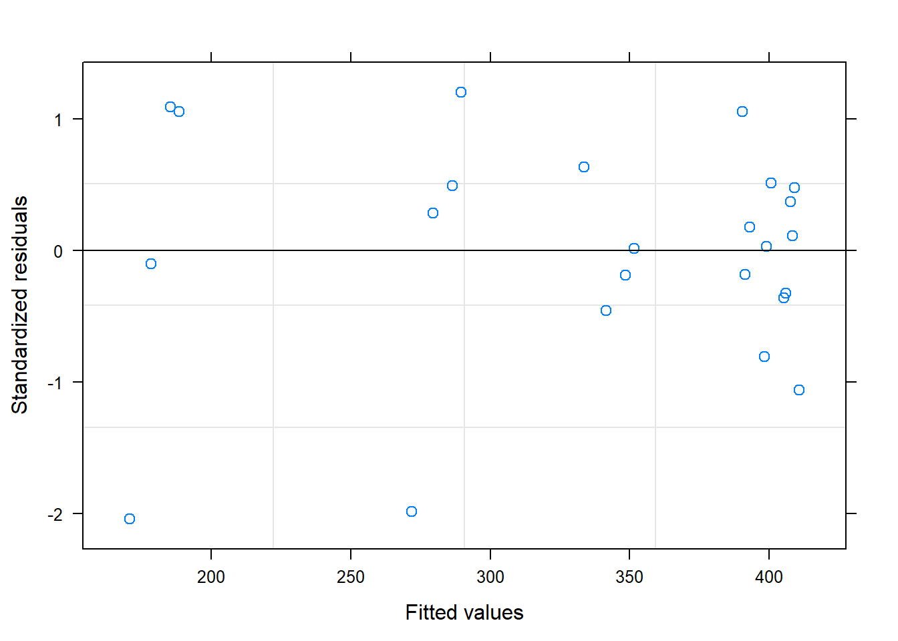
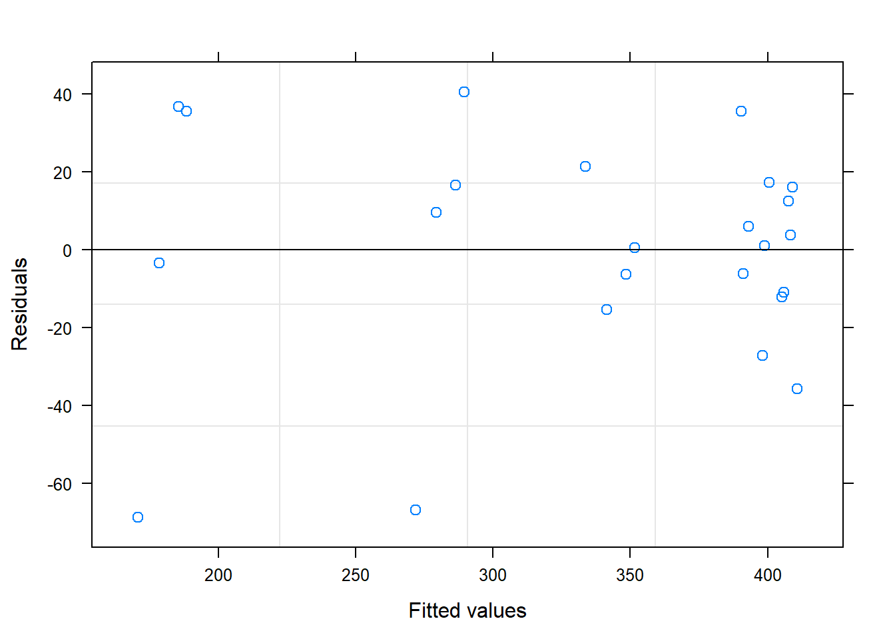
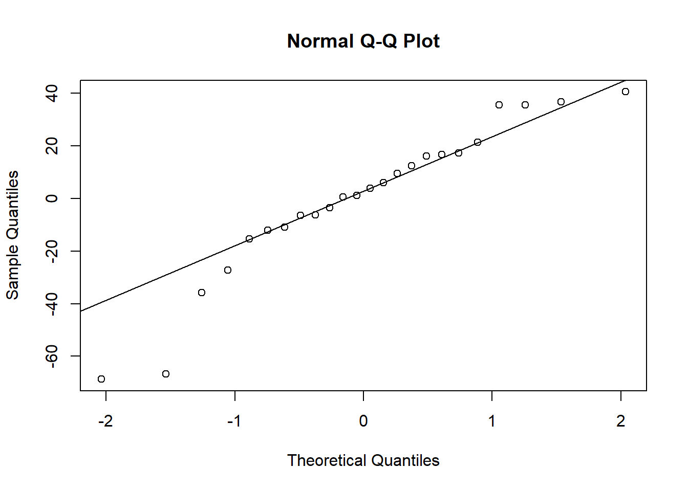
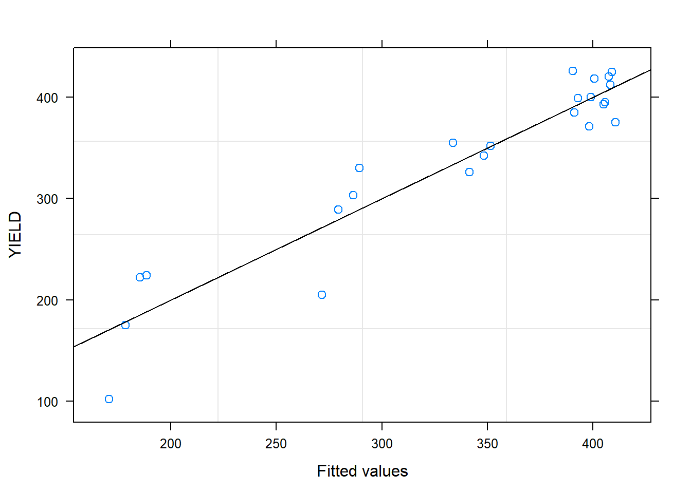

# Yield loss {#yieldloss}

## Load packages

Here is the R code to download the required packages for this exercise.


```r
# install package manager 'pacman'
if (!require(pacman)){
  install.packages('pacman')
}
```

```
## Loading required package: pacman
```

```r
# load packages needed for this exercise
pacman::p_load(tidyverse,
       nlme,
       emmeans,
       predictmeans
       )
```

## Data

This is equivalent to the data step in SAS. Here, the data is imported from a file `yield_loss.csv` using the function `read_csv`.


```r
# Import data
a <- read_csv("data/yield_loss.csv")
```

```
## Parsed with column specification:
## cols(
##   WP = col_double(),
##   SP = col_character(),
##   BLK = col_double(),
##   TRT = col_double(),
##   FUNG = col_double(),
##   DS = col_double(),
##   YIELD = col_double()
## )
```

```r
# print the data
a
```

```
## # A tibble: 24 x 7
##       WP SP      BLK   TRT  FUNG    DS YIELD
##    <dbl> <chr> <dbl> <dbl> <dbl> <dbl> <dbl>
##  1   101 A         1     1     0    43   205
##  2   101 B         1     1     1     1   399
##  3   102 A         1     2     1     2   426
##  4   102 B         1     2     0    92   102
##  5   103 A         1     3     1     2   385
##  6   103 B         1     3     0     7   355
##  7   201 A         2     2     1     4   412
##  8   201 B         2     2     0    75   224
##  9   202 A         2     3     1     3   425
## 10   202 B         2     3     0    10   352
## # ... with 14 more rows
```

```r
# specify that FUNG, TRT, and BLK are factors
a$FUNG <- as.ordered(as.factor(a$FUNG))
a$TRT <- as.ordered(as.factor(a$TRT))
a$BLK <- as.ordered(as.factor(a$BLK))
```

## Mixed model for response variable DS 


```r
# fit the model  
mm_1 <- lme(DS ~ TRT*FUNG, # fixed effects
            data = a,
            random = ~1|BLK/TRT) # read mm_1 as mixed model 1

# summary output
summary(mm_1)
```

```
## Linear mixed-effects model fit by REML
##  Data: a 
##        AIC      BIC    logLik
##   156.1691 164.1825 -69.08456
## 
## Random effects:
##  Formula: ~1 | BLK
##          (Intercept)
## StdDev: 0.0009561632
## 
##  Formula: ~1 | TRT %in% BLK
##         (Intercept) Residual
## StdDev: 0.001007113 7.918859
## 
## Fixed effects: DS ~ TRT * FUNG 
##                   Value Std.Error DF    t-value p-value
## (Intercept)   20.708333  1.616430  9  12.811150  0.0000
## TRT.L         -9.457553  2.799740  6  -3.378012  0.0149
## TRT.Q        -19.646949  2.799740  6  -7.017420  0.0004
## FUNG.L       -26.457579  2.285978  9 -11.573857  0.0000
## TRT.L:FUNG.L  13.625000  3.959430  9   3.441152  0.0074
## TRT.Q:FUNG.L  26.485944  3.959430  9   6.689333  0.0001
##  Correlation: 
##              (Intr) TRT.L TRT.Q FUNG.L TRT.L:
## TRT.L        0                               
## TRT.Q        0      0                        
## FUNG.L       0      0     0                  
## TRT.L:FUNG.L 0      0     0     0            
## TRT.Q:FUNG.L 0      0     0     0      0     
## 
## Standardized Within-Group Residuals:
##           Min            Q1           Med            Q3           Max 
## -2.241484e+00 -9.471064e-02 -1.590814e-08  1.736361e-01  2.683467e+00 
## 
## Number of Observations: 24
## Number of Groups: 
##          BLK TRT %in% BLK 
##            4           12
```

```r
# type 3 tests of fixed effects
anova(mm_1)
```

```
##             numDF denDF   F-value p-value
## (Intercept)     1     9 164.12557  <.0001
## TRT             2     6  30.32757   7e-04
## FUNG            1     9 133.95416  <.0001
## TRT:FUNG        2     9  28.29435   1e-04
```

```r
# visualize interaction
emmip(mm_1, TRT ~ FUNG)
```


```r
# to do anova for random effects, we need to compare mm_1 with a model that only has fixed effects,
# we can use `gls()` function in `nlme` to fit the fixed effects model
fixed_model <- gls(DS ~ TRT * FUNG,
									 data = a)

# test the random effects in the model
anova(mm_1, fixed_model)
```

```
##             Model df      AIC      BIC    logLik   Test      L.Ratio
## mm_1            1  9 156.1691 164.1825 -69.08456                    
## fixed_model     2  7 152.1691 158.4017 -69.08456 1 vs 2 1.250038e-08
##             p-value
## mm_1               
## fixed_model       1
```

```r
# least square means
test(emmeans(mm_1, "TRT"))
```

```
## NOTE: Results may be misleading due to involvement in interactions
```

```
##  TRT emmean  SE df t.ratio p.value
##  1     19.4 2.8  3  6.920  0.0062 
##  2     36.8 2.8  3 13.126  0.0010 
##  3      6.0 2.8  3  2.143  0.1215 
## 
## Results are averaged over the levels of: FUNG 
## d.f. method: containment
```

```r
test(emmeans(mm_1, "FUNG"))
```

```
## NOTE: Results may be misleading due to involvement in interactions
```

```
##  FUNG emmean   SE df t.ratio p.value
##  0      39.4 2.29  3 17.243  0.0004 
##  1       2.0 2.29  3  0.875  0.4460 
## 
## Results are averaged over the levels of: TRT 
## d.f. method: containment
```

```r
# pairwise difference
test(emmeans(mm_1, pairwise ~ TRT), adjust = "none")
```

```
## NOTE: Results may be misleading due to involvement in interactions
```

```
## $emmeans
##  TRT emmean  SE df t.ratio p.value
##  1     19.4 2.8  3  6.920  0.0062 
##  2     36.8 2.8  3 13.126  0.0010 
##  3      6.0 2.8  3  2.143  0.1215 
## 
## Results are averaged over the levels of: FUNG 
## d.f. method: containment 
## 
## $contrasts
##  contrast estimate   SE df t.ratio p.value
##  1 - 2       -17.4 3.96  6 -4.388  0.0046 
##  1 - 3        13.4 3.96  6  3.378  0.0149 
##  2 - 3        30.8 3.96  6  7.766  0.0002 
## 
## Results are averaged over the levels of: FUNG
```

```r
test(emmeans(mm_1, pairwise ~ FUNG))
```

```
## NOTE: Results may be misleading due to involvement in interactions
```

```
## $emmeans
##  FUNG emmean   SE df t.ratio p.value
##  0      39.4 2.29  3 17.243  0.0004 
##  1       2.0 2.29  3  0.875  0.4460 
## 
## Results are averaged over the levels of: TRT 
## d.f. method: containment 
## 
## $contrasts
##  contrast estimate   SE df t.ratio p.value
##  0 - 1        37.4 3.23  9 11.574  <.0001 
## 
## Results are averaged over the levels of: TRT
```

```r
test(emmeans(mm_1, pairwise ~ TRT*FUNG), adjust = "none")
```

```
## $emmeans
##  TRT FUNG emmean   SE df t.ratio p.value
##  1   0     37.25 3.96  3  9.408  0.0025 
##  2   0     70.75 3.96  3 17.869  0.0004 
##  3   0     10.25 3.96  3  2.589  0.0812 
##  1   1      1.50 3.96  3  0.379  0.7300 
##  2   1      2.75 3.96  3  0.695  0.5373 
##  3   1      1.75 3.96  3  0.442  0.6884 
## 
## d.f. method: containment 
## 
## $contrasts
##  contrast  estimate  SE df t.ratio p.value
##  1,0 - 2,0   -33.50 5.6  6 -5.983  0.0010 
##  1,0 - 3,0    27.00 5.6  6  4.822  0.0029 
##  1,0 - 1,1    35.75 5.6  9  6.385  0.0001 
##  1,0 - 2,1    34.50 5.6  6  6.161  0.0008 
##  1,0 - 3,1    35.50 5.6  6  6.340  0.0007 
##  2,0 - 3,0    60.50 5.6  6 10.805  <.0001 
##  2,0 - 1,1    69.25 5.6  6 12.367  <.0001 
##  2,0 - 2,1    68.00 5.6  9 12.144  <.0001 
##  2,0 - 3,1    69.00 5.6  6 12.323  <.0001 
##  3,0 - 1,1     8.75 5.6  6  1.563  0.1692 
##  3,0 - 2,1     7.50 5.6  6  1.339  0.2289 
##  3,0 - 3,1     8.50 5.6  9  1.518  0.1633 
##  1,1 - 2,1    -1.25 5.6  6 -0.223  0.8308 
##  1,1 - 3,1    -0.25 5.6  6 -0.045  0.9658 
##  2,1 - 3,1     1.00 5.6  6  0.179  0.8641
```

### Diagnostic plots


```r
# pearson residuals vs. fitted values
plot(mm_1, resid(., type="pearson") ~ fitted(.), abline = 0)
```


```r
# standardaized residuals vs. fitted values
plot(mm_1, resid(., scaled=TRUE) ~ fitted(.), abline = 0)
```


```r
# qq plot
qqnorm(residuals(mm_1))
qqline(residuals(mm_1))
```


```r
#observed vs. fitted values
plot(mm_1, DS ~ fitted(.), abline = c(0,1))
```


## Mixed model for response variable YIELD 


```r
# fit the model  
mm_2 <- lme(YIELD ~ TRT*FUNG, # fixed effects
            data = a,
            random = ~1|BLK/TRT) # read mm_2 as mixed model 2

# summary output
summary(mm_2)
```

```
## Linear mixed-effects model fit by REML
##  Data: a 
##        AIC      BIC   logLik
##   209.9214 217.9348 -95.9607
## 
## Random effects:
##  Formula: ~1 | BLK
##         (Intercept)
## StdDev:    11.99815
## 
##  Formula: ~1 | TRT %in% BLK
##         (Intercept) Residual
## StdDev: 0.001914579 33.61779
## 
## Fixed effects: YIELD ~ TRT * FUNG 
##                 Value Std.Error DF  t-value p-value
## (Intercept)  335.1667  9.114752  9 36.77189  0.0000
## TRT.L         21.3016 11.885682  6  1.79221  0.1233
## TRT.Q         54.5522 11.885682  6  4.58974  0.0037
## FUNG.L        93.9274  9.704619  9  9.67862  0.0000
## TRT.L:FUNG.L -31.8750 16.808893  9 -1.89632  0.0904
## TRT.Q:FUNG.L -75.2720 16.808893  9 -4.47811  0.0015
##  Correlation: 
##              (Intr) TRT.L TRT.Q FUNG.L TRT.L:
## TRT.L        0                               
## TRT.Q        0      0                        
## FUNG.L       0      0     0                  
## TRT.L:FUNG.L 0      0     0     0            
## TRT.Q:FUNG.L 0      0     0     0      0     
## 
## Standardized Within-Group Residuals:
##         Min          Q1         Med          Q3         Max 
## -2.04399017 -0.33265713  0.07191314  0.49972251  1.20545632 
## 
## Number of Observations: 24
## Number of Groups: 
##          BLK TRT %in% BLK 
##            4           12
```

```r
# type 3 tests of fixed effects
anova(mm_2)
```

```
##             numDF denDF   F-value p-value
## (Intercept)     1     9 1352.1720  <.0001
## TRT             2     6   12.1389  0.0078
## FUNG            1     9   93.6757  <.0001
## TRT:FUNG        2     9   11.8247  0.0030
```

```r
# visualize interaction
emmip(mm_2, TRT ~ FUNG)
```


```r
# to do anova for random effects, we need to compare mm_1 with a model that only has fixed effects,
# we can use `gls()` function in `nlme` to fit the fixed effects model
fixed_model_YIELD <- gls(YIELD ~ TRT * FUNG,
									 data = a)

# test the random effects in the model
anova(mm_2, fixed_model_YIELD)
```

```
##                   Model df      AIC      BIC    logLik   Test   L.Ratio
## mm_2                  1  9 209.9214 217.9348 -95.96070                 
## fixed_model_YIELD     2  7 206.3763 212.6089 -96.18815 1 vs 2 0.4548877
##                   p-value
## mm_2                     
## fixed_model_YIELD  0.7966
```

```r
# least square means
test(emmeans(mm_2, "TRT"))
```

```
## NOTE: Results may be misleading due to involvement in interactions
```

```
##  TRT emmean   SE df t.ratio p.value
##  1      342 13.3  3 25.716  0.0001 
##  2      291 13.3  3 21.829  0.0002 
##  3      372 13.3  3 27.978  0.0001 
## 
## Results are averaged over the levels of: FUNG 
## d.f. method: containment
```

```r
test(emmeans(mm_2, "FUNG"))
```

```
## NOTE: Results may be misleading due to involvement in interactions
```

```
##  FUNG emmean   SE df t.ratio p.value
##  0       269 11.4  3 23.556  0.0002 
##  1       402 11.4  3 35.198  0.0001 
## 
## Results are averaged over the levels of: TRT 
## d.f. method: containment
```

```r
# pairwise difference
test(emmeans(mm_2, pairwise ~ TRT), adjust = "none")
```

```
## NOTE: Results may be misleading due to involvement in interactions
```

```
## $emmeans
##  TRT emmean   SE df t.ratio p.value
##  1      342 13.3  3 25.716  0.0001 
##  2      291 13.3  3 21.829  0.0002 
##  3      372 13.3  3 27.978  0.0001 
## 
## Results are averaged over the levels of: FUNG 
## d.f. method: containment 
## 
## $contrasts
##  contrast estimate   SE df t.ratio p.value
##  1 - 2        51.8 16.8  6  3.079  0.0217 
##  1 - 3       -30.1 16.8  6 -1.792  0.1233 
##  2 - 3       -81.9 16.8  6 -4.871  0.0028 
## 
## Results are averaged over the levels of: FUNG
```

```r
test(emmeans(mm_2, pairwise ~ FUNG))
```

```
## NOTE: Results may be misleading due to involvement in interactions
```

```
## $emmeans
##  FUNG emmean   SE df t.ratio p.value
##  0       269 11.4  3 23.556  0.0002 
##  1       402 11.4  3 35.198  0.0001 
## 
## Results are averaged over the levels of: TRT 
## d.f. method: containment 
## 
## $contrasts
##  contrast estimate   SE df t.ratio p.value
##  0 - 1        -133 13.7  9 -9.679  <.0001 
## 
## Results are averaged over the levels of: TRT
```

```r
test(emmeans(mm_2, pairwise ~ TRT*FUNG), adjust = "none")
```

```
## $emmeans
##  TRT FUNG emmean   SE df t.ratio p.value
##  1   0       282 17.8  3 15.787  0.0006 
##  2   0       181 17.8  3 10.128  0.0021 
##  3   0       344 17.8  3 19.261  0.0003 
##  1   1       403 17.8  3 22.580  0.0002 
##  2   1       400 17.8  3 22.440  0.0002 
##  3   1       401 17.8  3 22.482  0.0002 
## 
## d.f. method: containment 
## 
## $contrasts
##  contrast  estimate   SE df t.ratio p.value
##  1,0 - 2,0   101.00 23.8  6  4.249  0.0054 
##  1,0 - 3,0   -62.00 23.8  6 -2.608  0.0402 
##  1,0 - 1,1  -121.25 23.8  9 -5.101  0.0006 
##  1,0 - 2,1  -118.75 23.8  6 -4.996  0.0025 
##  1,0 - 3,1  -119.50 23.8  6 -5.027  0.0024 
##  2,0 - 3,0  -163.00 23.8  6 -6.857  0.0005 
##  2,0 - 1,1  -222.25 23.8  6 -9.349  0.0001 
##  2,0 - 2,1  -219.75 23.8  9 -9.244  <.0001 
##  2,0 - 3,1  -220.50 23.8  6 -9.276  0.0001 
##  3,0 - 1,1   -59.25 23.8  6 -2.492  0.0470 
##  3,0 - 2,1   -56.75 23.8  6 -2.387  0.0542 
##  3,0 - 3,1   -57.50 23.8  9 -2.419  0.0387 
##  1,1 - 2,1     2.50 23.8  6  0.105  0.9197 
##  1,1 - 3,1     1.75 23.8  6  0.074  0.9437 
##  2,1 - 3,1    -0.75 23.8  6 -0.032  0.9759
```

### Diagnostic plots


```r
# pearson residuals vs. fitted values
plot(mm_2, resid(., type="pearson") ~ fitted(.), abline = 0)
```



```r
# standardaized residuals vs. fitted values
plot(mm_2, resid(., scaled=TRUE) ~ fitted(.), abline = 0)
```



```r
# qq plot
qqnorm(residuals(mm_2))
qqline(residuals(mm_2))
```



```r
#observed vs. fitted values
plot(mm_2, YIELD ~ fitted(.), abline = c(0,1))
```



## Linear regression between YIELD and DS  


```r
# fit `lm` model
lm_1 <- lm(YIELD ~ DS, data = a) 
summary(lm_1)
```

```
## 
## Call:
## lm(formula = YIELD ~ DS, data = a)
## 
## Residuals:
##     Min      1Q  Median      3Q     Max 
## -61.196 -18.565   0.856  22.676  56.812 
## 
## Coefficients:
##             Estimate Std. Error t value Pr(>|t|)    
## (Intercept) 399.2384     8.0711   49.47  < 2e-16 ***
## DS           -3.0940     0.2399  -12.90 9.81e-12 ***
## ---
## Signif. codes:  0 '***' 0.001 '**' 0.01 '*' 0.05 '.' 0.1 ' ' 1
## 
## Residual standard error: 31.17 on 22 degrees of freedom
## Multiple R-squared:  0.8832,	Adjusted R-squared:  0.8779 
## F-statistic: 166.4 on 1 and 22 DF,  p-value: 9.809e-12
```

```r
anova(lm_1)
```

```
## Analysis of Variance Table
## 
## Response: YIELD
##           Df Sum Sq Mean Sq F value    Pr(>F)    
## DS         1 161600  161600  166.38 9.809e-12 ***
## Residuals 22  21368     971                      
## ---
## Signif. codes:  0 '***' 0.001 '**' 0.01 '*' 0.05 '.' 0.1 ' ' 1
```

```r
# diagnostic plots  
residplot(lm_1)
```

### Linear regression between RY1 and DS


```r
b <- a %>% 
	mutate(RY1 = YIELD/399.23843)

# fit linear regression model
lm_2 <- lm(RY1 ~ DS, data = b)
summary(lm_2)
```

```
## 
## Call:
## lm(formula = RY1 ~ DS, data = b)
## 
## Residuals:
##       Min        1Q    Median        3Q       Max 
## -0.153282 -0.046502  0.002143  0.056798  0.142301 
## 
## Coefficients:
##               Estimate Std. Error t value Pr(>|t|)    
## (Intercept)  1.0000000  0.0202162   49.47  < 2e-16 ***
## DS          -0.0077498  0.0006008  -12.90 9.81e-12 ***
## ---
## Signif. codes:  0 '***' 0.001 '**' 0.01 '*' 0.05 '.' 0.1 ' ' 1
## 
## Residual standard error: 0.07806 on 22 degrees of freedom
## Multiple R-squared:  0.8832,	Adjusted R-squared:  0.8779 
## F-statistic: 166.4 on 1 and 22 DF,  p-value: 9.809e-12
```

```r
anova(lm_2)
```

```
## Analysis of Variance Table
## 
## Response: RY1
##           Df  Sum Sq Mean Sq F value    Pr(>F)    
## DS         1 1.01385 1.01385  166.38 9.809e-12 ***
## Residuals 22 0.13406 0.00609                      
## ---
## Signif. codes:  0 '***' 0.001 '**' 0.01 '*' 0.05 '.' 0.1 ' ' 1
```

```r
# diagnostic plots  
residplot(lm_2)
```

### Transform dataset a


```r
a_yield <- a %>% 
	dplyr::select(BLK, TRT, YIELD) %>% 
	arrange(BLK, TRT, YIELD) %>% 
	group_by(BLK, TRT) %>% 
	summarise(RY2 = YIELD[1]/YIELD[2]) %>% 
	ungroup()


a_ds <- a %>% 
	dplyr::select(BLK, TRT, DS) %>% 
	arrange(BLK, TRT, DS) %>% 
	group_by(BLK, TRT) %>% 
	summarise(CDS = DS[2]) %>% 
	ungroup()

a_new <- a_yield %>% 
	inner_join(a_ds) %>% 
	ungroup() %>% 
	mutate(BLK = parse_factor(as.character(BLK)),
				 TRT = parse_factor(as.character(TRT)))
```

```
## Joining, by = c("BLK", "TRT")
```

```r
# print the data
a_new
```

```
## # A tibble: 12 x 4
##    BLK   TRT     RY2   CDS
##    <fct> <fct> <dbl> <dbl>
##  1 1     1     0.514    43
##  2 1     2     0.239    92
##  3 1     3     0.922     7
##  4 2     1     0.88     27
##  5 2     2     0.544    75
##  6 2     3     0.828    10
##  7 3     1     0.721    47
##  8 3     2     0.565    63
##  9 3     3     0.866    12
## 10 4     1     0.691    32
## 11 4     2     0.472    53
## 12 4     3     0.815    12
```

## Mixed model for RY2


```r
# fit the model  
mm_3 <- lme(RY2 ~ TRT, # fixed effects
            data = a_new,
            random = ~1|BLK) # read mm_3 as mixed model 3

# summary output
summary(mm_3)
```

```
## Linear mixed-effects model fit by REML
##  Data: a_new 
##       AIC      BIC   logLik
##   2.04077 3.026893 3.979615
## 
## Random effects:
##  Formula: ~1 | BLK
##         (Intercept)  Residual
## StdDev:  0.05297273 0.1134963
## 
## Fixed effects: RY2 ~ TRT 
##                  Value  Std.Error DF   t-value p-value
## (Intercept)  0.7016501 0.06262490  6 11.204012  0.0000
## TRT2        -0.2467228 0.08025398  6 -3.074274  0.0218
## TRT3         0.1561339 0.08025398  6  1.945497  0.0997
##  Correlation: 
##      (Intr) TRT2  
## TRT2 -0.641       
## TRT3 -0.641  0.500
## 
## Standardized Within-Group Residuals:
##         Min          Q1         Med          Q3         Max 
## -1.50508335 -0.38516867 -0.01698779  0.58195830  1.29565814 
## 
## Number of Observations: 12
## Number of Groups: 4
```

```r
# type 3 tests of fixed effects
anova(mm_3)
```

```
##             numDF denDF   F-value p-value
## (Intercept)     1     6 254.00333  <.0001
## TRT             2     6  12.81141  0.0068
```

```r
# to do anova for random effects, we need to compare mm_1 with a model that only has fixed effects,
# we can use `gls()` function in `nlme` to fit the fixed effects model
fixed_model_RY2 <- gls(RY2 ~ TRT,
									 data = a_new)

# test the random effects in the model
anova(mm_3, fixed_model_RY2)
```

```
##                 Model df       AIC      BIC   logLik   Test   L.Ratio
## mm_3                1  5 2.0407705 3.026893 3.979615                 
## fixed_model_RY2     2  4 0.3057644 1.094663 3.847118 1 vs 2 0.2649939
##                 p-value
## mm_3                   
## fixed_model_RY2  0.6067
```

```r
# pairwise difference
test(emmeans(mm_3, pairwise ~ TRT), adjust = "none")
```

```
## $emmeans
##  TRT emmean     SE df t.ratio p.value
##  1    0.702 0.0626  3 11.204  0.0015 
##  2    0.455 0.0626  3  7.264  0.0054 
##  3    0.858 0.0626  3 13.697  0.0008 
## 
## d.f. method: containment 
## 
## $contrasts
##  contrast estimate     SE df t.ratio p.value
##  1 - 2       0.247 0.0803  6  3.074  0.0218 
##  1 - 3      -0.156 0.0803  6 -1.945  0.0997 
##  2 - 3      -0.403 0.0803  6 -5.020  0.0024
```

```r
# diagnostic plots  
residplot(mm_3)
```

## Linear regression between RY2 and CDS


```r
# fit linear regression model
lm_3 <- lm(RY2 ~ CDS, data = a_new)
summary(lm_3)
```

```
## 
## Call:
## lm(formula = RY2 ~ CDS, data = a_new)
## 
## Residuals:
##      Min       1Q   Median       3Q      Max 
## -0.13338 -0.05085 -0.01090  0.06530  0.12439 
## 
## Coefficients:
##               Estimate Std. Error t value Pr(>|t|)    
## (Intercept)  0.9386111  0.0467991  20.056 2.09e-09 ***
## CDS         -0.0067778  0.0009845  -6.884 4.28e-05 ***
## ---
## Signif. codes:  0 '***' 0.001 '**' 0.01 '*' 0.05 '.' 0.1 ' ' 1
## 
## Residual standard error: 0.09061 on 10 degrees of freedom
## Multiple R-squared:  0.8258,	Adjusted R-squared:  0.8083 
## F-statistic: 47.39 on 1 and 10 DF,  p-value: 4.275e-05
```

```r
anova(lm_3)
```

```
## Analysis of Variance Table
## 
## Response: RY2
##           Df  Sum Sq Mean Sq F value    Pr(>F)    
## CDS        1 0.38914 0.38914  47.394 4.275e-05 ***
## Residuals 10 0.08211 0.00821                      
## ---
## Signif. codes:  0 '***' 0.001 '**' 0.01 '*' 0.05 '.' 0.1 ' ' 1
```

```r
# diagnostic plots  
residplot(lm_3)
```

